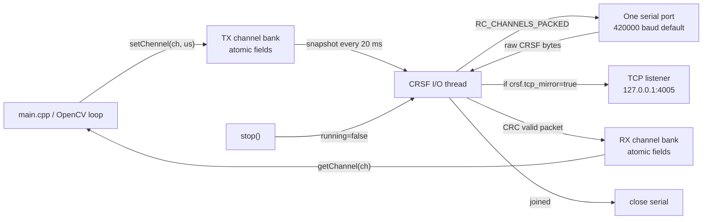

# OpenCV CRSF Tracker

This project runs an OpenCV tracking loop and can optionally open one CRSF serial
port for RC input/output. The CRSF serial logic is asynchronous, so serial reads
and writes do not block the main computer-vision loop.

When CRSF is active and `crsf.tcp_mirror` is enabled, the application listens on
TCP `127.0.0.1:4005`. Each generated CRSF packet is mirrored as raw bytes to the
connected TCP client. The listener is nonblocking and does not stop serial
output if no client is present. Receivers such as `UCRSFParserComponent` should
connect as TCP clients. The TCP stream has no additional envelope or length
prefix: it contains consecutive raw 26-byte `RC_CHANNELS_PACKED` frames.

## Build

Windows MSVC build from a normal PowerShell needs the Visual Studio developer
environment:

```powershell
& cmd.exe /d /s /c '"C:\Program Files (x86)\Microsoft Visual Studio\18\BuildTools\Common7\Tools\VsDevCmd.bat" -arch=x64 && "C:\Program Files\CMake\bin\cmake.EXE" -S c:/VScode_projects/cv -B c:/VScode_projects/cv/build -G Ninja -DCMAKE_BUILD_TYPE=Debug && "C:\Program Files\CMake\bin\cmake.EXE" --build c:/VScode_projects/cv/build --config Debug --target all --'
```

## Deploy To Raspberry Pi

The expected Raspberry Pi checkout is:

```bash
git clone git@github.com:AndriiYe/mv.git ~/mv
```

From the Windows PC, deploy and build on the Pi:

```powershell
.\scripts\deploy-pi.ps1
```

Deploy, build, and run:

```powershell
.\scripts\deploy-pi.ps1 -Run
```

Deploy, build, and install Raspberry Pi desktop autostart:

```powershell
.\scripts\deploy-pi.ps1 -InstallAutostart
```

The script pushes the current clean local branch to GitHub, SSHs to
`pi@192.168.0.210`, runs `git pull --ff-only` in `/home/pi/mv`, configures with
Ninja, and builds on the Pi. The same commands are available in VS Code as:

- `Deploy: Raspberry Pi build`
- `Deploy: Raspberry Pi build and run`

For a reusable setup guide that can be applied to other projects, see
`docs/git_ssh_raspberry_pi_deploy_workflow.md`.

To start the tracker automatically when the Raspberry Pi desktop logs in, see
`docs/raspberry_pi_startup.md`.

## Configure CRSF

CRSF is configured through `config.json`. Windows serial ports look like this:

```json
"crsf": {
  "device": "COM47",
  "baudrate": 420000,
  "tcp_mirror": true
}
```

Raspberry Pi 5 serial ports use Linux device paths:

```json
"crsf": {
  "device": "/dev/ttyAMA0",
  "baudrate": 420000,
  "tcp_mirror": false
}
```

Set `tcp_mirror` to `false` on Raspberry Pi when no local TCP debug client is
needed. This avoids opening the `127.0.0.1:4005` listener.

Leave `device` empty to disable CRSF:

```json
"crsf": {
  "device": "",
  "baudrate": 420000,
  "tcp_mirror": true
}
```

## PID RC Tuning

PID tuning is optional and off by default. Add or edit this block in
`config.json`:

```json
"pid": {
  "kp": 1.2,
  "ki": 0.0,
  "kd": 0.05,
  "output_limit": 300.0,
  "integral_limit": 5000.0,
  "tune_from_rc": true
}
```

When `tune_from_rc` is `true`, the controller reads live gains from CRSF RX
channels:

- Channel 9 controls `kp`: `1000 us = 0.0`, `1500 us = 1.0`, `2000 us = 2.0`.
- Channel 10 controls `ki`: `1000 us = 0.0`, `1500 us = 0.25`, `2000 us = 0.5`.
- Channel 11 controls `kd`: `1000 us = 0.0`, `1500 us = 0.5`, `2000 us = 1.0`.

Safe first pass:

1. Remove propellers or otherwise make the controlled system safe before live
   tuning.
2. Assign transmitter knobs/sliders to channels 9, 10, and 11.
3. Start with channel 10 low (`ki = 0`) and channel 11 low-to-slightly-raised
   (`kd = 0.0` to `0.1`).
4. Raise channel 9 slowly until the target recenters but starts to oscillate,
   then back it down by about 20-30%.
5. Raise channel 11 just enough to damp overshoot.
6. Add channel 10 only if there is a steady residual offset; use the smallest
   value that removes the offset.

The preview window shows the active `kp`, `ki`, and `kd`, so knob changes should
be visible immediately after valid RC packets arrive.

## Kalman Filter RC Tuning

The Kalman filter smooths the measured optical-flow speed before that speed is
used by PID derivative damping. Add or edit this block in `config.json`:

```json
"kalman": {
  "process_noise": 0.02,
  "measurement_noise": 1.0,
  "estimate_error": 1.0,
  "tune_from_rc": true
}
```

When `kalman.tune_from_rc` is `true`, the filter reads live noise values from
CRSF RX channels:

- Channel 12 controls `R` / `measurement_noise`: `1000 us = 0.1`,
  `1500 us = 1.0`, `2000 us = 5.0`.
- Channel 13 controls `Q` / `process_noise`: `1000 us = 0.001`,
  `1500 us = 0.02`, `2000 us = 0.2`.

Start with both controls centered. If `kdx/kdy` or the red speed arrow is noisy,
raise `R` or lower `Q`. If the speed estimate lags behind real target motion,
lower `R` or raise `Q`. Tune the Kalman filter before final PID `kd` tuning,
because `kd` depends on this filtered speed estimate.

The preview window shows the active `R` and `Q` values after valid RC packets
arrive.

## Run From JSON Config

`cv.exe` automatically loads the first `config.json` it finds in the current
working directory, next to the executable, or one directory above the executable.
The JSON file can keep all launch options in one place:

```json
{
  "capture": {
    "mode": "camera",
    "source": "C:/VScode_projects/cv/src/w22.mp4",
    "camera_index": 0,
    "width": 640,
    "height": 480,
    "fps": 30,
    "screen_left": 100,
    "screen_top": 100,
    "screen_width": 800,
    "screen_height": 600
  },
  "crsf": {
    "device": "COM47",
    "baudrate": 420000,
    "tcp_mirror": true
  },
  "pid": {
    "kp": 1.2,
    "ki": 0.0,
    "kd": 0.05,
    "output_limit": 300.0,
    "integral_limit": 5000.0,
    "tune_from_rc": false
  },
  "kalman": {
    "process_noise": 0.02,
    "measurement_noise": 1.0,
    "estimate_error": 1.0,
    "tune_from_rc": false
  }
}
```

Set `capture.mode` to one of:

- `camera`
- `video`
- `pi-camera`
- `screen`
- `screen-virtual`
- `screen-region`

When `capture.mode` is `screen-region`, the capture position can be adjusted
while the app is running with `W`/`A`/`S`/`D` or the arrow keys. The region moves
10 pixels per key press and keeps the configured width and height.

To open the preview window fullscreen, add:

```json
"display": {
  "fullscreen": true
}
```

With that file present, run the app without the long command line:

```powershell
.\build\cv.exe
```

Runtime command-line options are intentionally not read. Edit `config.json` to
change capture source, CRSF port, baud rate, size, FPS, PID tuning settings, or
Kalman filter tuning settings. If no `config.json` is found, the app exits with
an error.

## Public CRSF API

`CrsfRcSender` keeps the public channel API intentionally small:

```cpp
CrsfRcSender crsf("COM3");
crsf.start();

crsf.setChennel(1, 1000);          // transmit channel 1 at 1000 us
uint16_t ch1 = crsf.getChannel(1); // latest received channel 1, or 0 before RX

crsf.stop();
```

Channel numbers are 1-based: `1` through `16`.

The method name is currently `setChennel` to match the requested API spelling.

## Async Design



Important behavior:

- `setChennel()` only writes one atomic channel value. It does not touch the
  serial port.
- `getChannel()` only reads one atomic channel value. It does not wait for a
  serial packet.
- One I/O thread reads available bytes first, validates CRSF CRC, stores the
  latest received channel bank, then sends the current TX channel bank every
  `20 ms`.
- If `crsf.tcp_mirror` is true, the same transmitted packet is also mirrored to
  one local TCP client on `127.0.0.1:4005`.
- `stop()` clears one shared `running_` atomic flag, joins the I/O thread, and
  only then closes the serial handle.

## Current Demo Behavior

When `crsf.device` is not empty, `main.cpp` starts the CRSF runtime, reads RC
input channels for cursor/tuning, and writes PID output on channels 4
horizontal and 3 vertical. PID tuning uses channels 9/10/11, and Kalman filter
tuning uses channels 12/13. All other transmitted channels remain at their last
set value, initialized to neutral `1500 us`. TCP mirroring is optional through
`crsf.tcp_mirror`.
