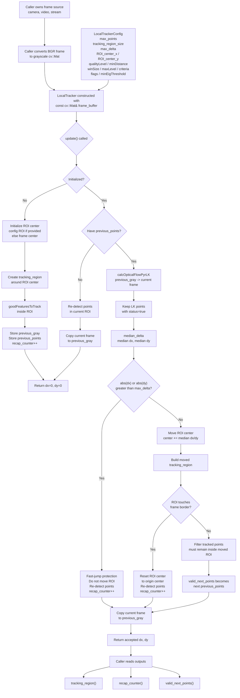

# LocalTracker Design

`LocalTracker` owns the local optical-flow state machine for one grayscale frame
buffer. Capture, BGR-to-gray conversion, drawing, and `imshow` stay outside the
class.

## Input Data

- `frame_buffer`: grayscale `cv::Mat` reference updated by the caller before
  every `update()` call.
- `LocalTrackerConfig`: feature detection, LK optical-flow, ROI, and guard
  parameters.

## Processing Stages

1. Initialize ROI origin from config center, or frame center by default.
2. Detect feature points in the local ROI.
3. Track points with pyramidal Lucas-Kanade optical flow.
4. Estimate motion using median `dx/dy` from valid point pairs.
5. Reject sudden jumps larger than `max_delta`.
6. Reset ROI to its origin center if the ROI touches a frame border.
7. Keep only points that remain inside the active ROI.

## Output Data

- `update()`: accepted median `dx/dy` for the frame.
- `tracking_region()`: current ROI rectangle.
- `recap_counter()`: number of feature re-detection events.
- `valid_next_points()`: current accepted points in frame coordinates.
